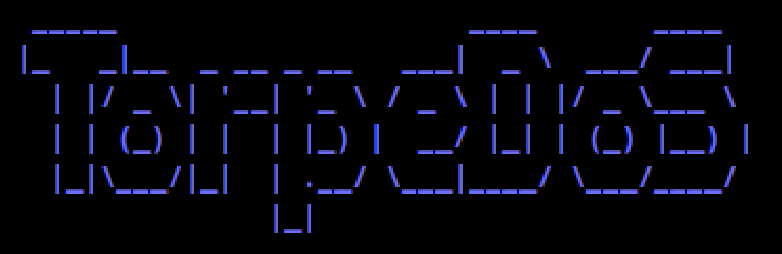
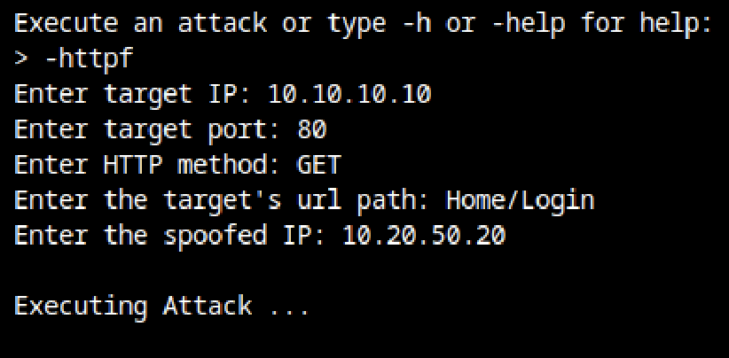
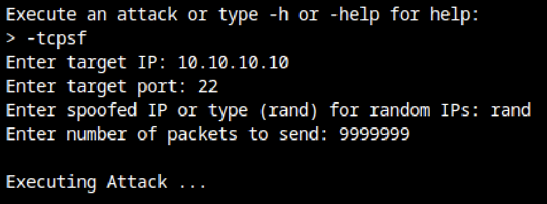

# TorpeDoS



## Description

**Note: Unauthorized use of DoS attacks is illegal and can cause harm to networks and systems. Use this tool responsibly and with proper authorization.**

TorpeDoS is a Denial of Service (DoS) tool developed in Python for testing purposes. It is designed to flood a target server with a high volume of requests, thereby overwhelming its resources. This tool should only be used with proper authorization and for responsible testing purposes.

## Prerequisites

- Python 3.x
- scapy
- colorama
- termcolor
- pyfiglet

## Usage

To execute an attack, run the TorpeDoS script as a super user (sudo) and follow the prompts.

``` sudo python torpedos.py ```


The tool currently supports the following types of DoS attacks:

1. **HTTP Flood Attack:** Launches a flood of HTTP requests to overwhelm the target web server. It supports HTTP methods such as GET, POST, and CONNECT.
 

2. **TCP SYN Flood Attack:** Floods the target with a large number of TCP connection requests, exhausting server resources.
 

## Installation

1. Clone the repository:

    ``` git clone https://github.com/M-Alhassan/TorpeDoS.git ```

2. Install the required dependencies:

    ``` pip install scapy colorama termcolor pyfiglet ```


## Author

| [<br><sub>@M-Alhassan</sub>](https://github.com/M-Alhassan) |
| :---------------------------------------------------------------------------------------------------------------------------: |# TorpeDoS
